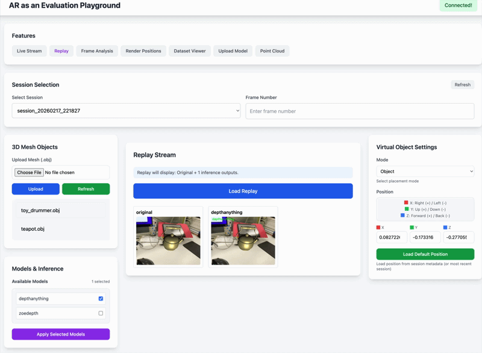

<div align="center">

# ARCADE

### AR as an Evaluation Playground: Bridging Metric and Visual Perception of Computer Vision Models
[](https://dl.acm.org/doi/10.1145/3793853.3795748)
[](https://arxiv.org/abs/2508.04102)


[**Ashkan Ganj**](https://ashkanganj.me/)<sup>1</sup> · [**Yiqin Zhao**](https://yiqinzhao.phd/)<sup>2</sup> · [**Tian Guo**](https://tianguo.info/)<sup>1</sup>

<sup>1</sup>Worcester Polytechnic Institute &emsp; <sup>2</sup>Rochester Institute of Technology

</div>


## Overview

ARCADE is an evaluation framework that bridges the gap between quantitative benchmarks and visual evaluation of computer vision models. By providing a reusable pipeline and interactive AR tasks, it enables researchers to complement metrics with direct visual inspection.





## Table of Contents

- [Project Structure](#project-structure)
- [Prerequisites](#prerequisites)
- [Installation](#installation)
- [Quick Start](#quick-start)
- [Mobile Clients](#mobile-clients)
- [Captured Data](#captured-data)
- [Case Studies](#case-studies)
- [Citation](#citation)

---

## Project Structure

| Path | Description |
|------|-------------|
| `src/server/` | Backend server (Tornado, handlers, workers) |
| `src/IOS_APP/` | iOS client for live capture |
| `src/webUI/` | Web interface |
| `src/case_study/lighting/` | Lighting case study example |
| `src/case_study/lighting/xihe` | Docker example for adding containerized models |
| `data/sessions/` | Captured sessions |
| `data/3D_models/` | 3D models |

>For a detailed breakdown of server modules—handlers, workers, state, config, and how to extend them. See [README.md](src/server/README.md).


## Installation

### 1. Clone the repository

```bash
git clone https://github.com/cake-lab/ARCADE
cd ARCADE
```

### 2. Create and activate the `Arcade` conda environment

```bash
conda env create -f environment.yml
conda activate Arcade
```

This creates an environment with Python 3.10 and installs PyTorch (CUDA 12.6) plus all server dependencies from `requirements.txt`.


## Quick Start

### Step 1: Start the server

```bash
cd src
python server.py 
```

The server listens on **port 5034** by default.

### Step 2: Serve the web UI

The web UI is static HTML/CSS/JS—no Node.js or build step required. In a **separate terminal**:

```bash
cd src/webUI
python -m http.server 8000
```

Open `http://localhost:8000` (or `http://<your-ip>:8000` on another device). The UI connects to the backend at `http://<server-ip>:5034` for WebSocket, API, and live/replay streams. Note that you need to be on the same network as the server.


## Captured Data
Captured sessions are saved in `data/sessions/`. When you capture a session from the mobile client, the server saves the following under `data/sessions/session_YYYYMMDD_HHMMSS/`:

| File | Description |
|------|-------------|
| `session_config.json` | Camera resolution, intrinsics, virtual object path, scale |
| `frame_00000_rgb.png` | RGB image |
| `frame_00000_depth.npy` | Depth map (float32 numpy) |
| `frame_00000_metadata.json` | AR pose, object position, etc. |
| `frame_00000_mask.png` | Object mask (optional; from client when using object placement) |
| `frame_00000_server_mask.png` | Server-rendered mask (created during replay when using object placement) |

> **Dataset viewer:** The dataset viewer (ScanNet) only works with **Plane** mode (virtual plane at a fixed depth). It does not support Object Placement mode. Use the web UI for object placement evaluation on captured sessions.

---

## Mobile Clients

| Platform | Instructions |
|----------|--------------|
| **iOS** | Build and run the included app. See [README.md](./src/IOS_APP/README.md) for build instructions. |
| **Android & cross-platform** | Use [ARFlow](https://github.com/cake-lab/ARFlow) for prebuilt clients and data streaming to the ARCADE server. |

---

## Case Studies

### Depth Case Study

The depth evaluation pipeline is **integrated** into ARCADE. Use the web UI to:

1. Select inference models (ZoeDepth, DepthAnything) via the model selector
2. Capture or replay sessions to compare predicted depth against ground truth
3. View depth colormaps, composites, and metrics in the frame details and dataset viewer

Models live in `src/server/modules/inference/` and are auto-discovered. See [src/server/README.md](src/server/README.md#adding-a-new-inference-model) for adding new depth models.

### Lighting Case Study

For lighting evaluation, use the example under `case_study/lighting`. Follow the README in that directory to run the lighting case study and extend it for your scenarios.

### Adding More Models (Docker)

To add models that run in isolated environments or require different dependencies, use the Docker example in `case_study/lighting/Dockerfile`. The example shows how to:

- Package a model as a containerized service
- Connect it to the ARCADE server
- Register and use it alongside built-in inference models

See [README.md](./src/case_study/README.md) for setup and usage.

---

## Citation

If you use ARCADE in your research, please cite:

```bibtex
@inproceedings{10.1145/3793853.3795748,
      author = {Ganj, Ashkan and Zhao, Yiqin and Guo, Tian},
      title = {AR as an Evaluation Playground: Bridging Metric and Visual Perception of Computer Vision Models},
      year = {2026},
      isbn = {9798400724817},
      publisher = {Association for Computing Machinery},
      address = {New York, NY, USA},
      url = {https://doi.org/10.1145/3793853.3795748},
      doi = {10.1145/3793853.3795748},
            abstract = {Quantitative metrics are central to evaluating computer vision (CV) models, but they often fail to capture real-world performance due to protocol inconsistencies and ground truth noise. While visual perception studies can complement these metrics, they often require end-to-end systems that are time-consuming to implement and setups that are difficult to reproduce. We systematically summarize key challenges in evaluating CV models and present the design of ARCADE1, an evaluation platform that leverages augmented reality (AR) to enable easy, reproducible, and human-centered CV evaluation. ARCADE uses a modular architecture that provides cross-platform data collection, pluggable model inference, and interactive AR tasks, supporting both metric and visual perception evaluation. We demonstrate ARCADE through a user study with 15 participants and case studies on two representative CV tasks, depth and lighting estimation, showing ARCADE can help reveal perceptual flaws in model quality that are often missed by traditional metrics. We also evaluate ARCADE's usability and performance, showing its flexibility as a reliable real-time platform.},
      booktitle = {Proceedings of the ACM Multimedia Systems Conference 2026},
      pages = {72–83},
      numpages = {12},
      keywords = {Evaluation methodology, computer vision, augmented reality, depth estimation, lighting estimation},
      location = {
      },
      series = {MMSys '26}
}


```


---

## License

This project is licensed under the terms of the LICENSE file in this repository.
